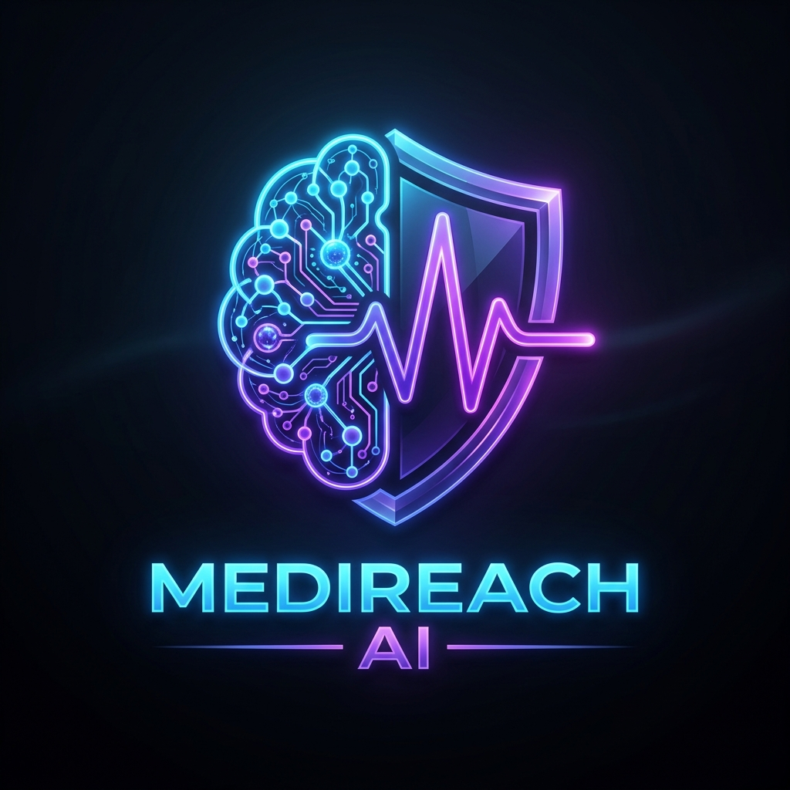
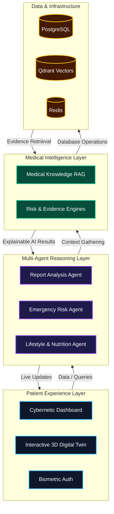

<div align="center">
  
  
  # MediReach AI
  
  ### Autonomous Healthcare Intelligence Platform
  
  [](https://nextjs.org/)
  [](https://react.dev/)
  [](https://tailwindcss.com/)
  [](https://www.typescriptlang.org/)
</div>

<br />

> **MediReach AI is a next-generation Healthcare Operating System.** It transitions medical AI from simply answering *"What is happening?"* to proactively predicting *"What will happen?"*. Featuring 3D anatomical visualization, a highly interactive cybernetic user interface, and multi-agent reasoning.

---

## 🏗️ 5-Layer Platform Architecture

Our system is engineered to scale from a patient portal into a full research-grade simulation engine.

### 1. Patient Experience Layer
- **Interactive Digital Twin:** A 3D virtual health clone of the patient that evolves over time.
- **Cybernetic Dashboard:** Live health scores, medical timelines, and hardware biometric authentication.

### 2. AI Agent Layer (Multi-Agent Reasoning)
- **Symptom & Report Analysis Agents:** Automates the extraction and translation of complex medical data.
- **Emergency & Prediction Agents:** Forecasting longitudinal risk and identifying immediate critical events.
- **Lifestyle & Nutrition Agents:** Providing holistic, personalized care pathways.

### 3. Medical Intelligence Layer
- **Knowledge Graph & Medical RAG:** Ensuring high-accuracy, explainable AI responses.
- **Evidence & Risk Engines:** Every prediction explicitly shows the *Why?* (e.g., Risk Score 81 due to High BP, Low Activity).

### 4. Data Layer
- **Vector & Graph Storage:** Utilizing PostgreSQL, Qdrant, and Redis for complex medical data relationships.

### 5. Infrastructure Layer
- **Cloud Native:** Dockerized, monitored, and deployed with robust CI/CD pipelines.

### 📊 Visual Architecture Diagram



---

## 🚀 The 5-Phase Roadmap

MediReach AI is actively being developed in 5 distinct phases to achieve the ultimate vision of a research-grade Healthcare OS.

### 🚀 Phase 1: Foundation (Completed)
- [x] High-contrast Cybernetic UI & Landing Page
- [x] Biometric Hardware Authentication (Face ID / Fingerprint Matrix)
- [x] Central Patient Dashboard
- [x] Medical Report Upload Interface

### 🧠 Phase 2: Medical Vision (Completed)
- [x] Upload processing for ECG, Chest X-Rays, and Blood Reports.
- [x] Automated AI extraction of medical findings.
- [x] Explainability UI (Showing the *Why* behind the findings).

### 🧬 Phase 3: The Digital Twin (In Progress)
- [x] Initial mapping of patient data to a Virtual Health Clone.
- [x] Interactive 3D human body interface.

### ⏳ Phase 4: 3D Anatomical Interaction
- [ ] Component-level 3D breakdowns (e.g., clicking the 'Heart' opens the Heart Health Dashboard).
- [ ] 3D visualization of isolated medical issues.

### ⏳ Phase 5: Agentic Healthcare OS
- [ ] Full deployment of the Multi-Agent layer.
- [ ] Graph-RAG integration for complex medical queries.
- [ ] Doctor, Patient, and Emergency Portals online.

---

## 🛠️ Local Development

To run the MediReach AI platform locally:

```bash
# Clone the repository
git clone https://github.com/saichintamani/medireach-AI.git

# Navigate into the project
cd medireach-AI

# Install dependencies
npm install

# Start the development server
npm run dev
```

Visit `http://localhost:3000` to access the terminal.

---

<div align="center">
  <p>Engineered by <strong>Sai Chintamani</strong></p>
  <p>
    <a href="mailto:saichintamani5@gmail.com">Contact Support</a> • 
    <a href="https://linkedin.com/in/sai-chintamani">LinkedIn Profile</a>
  </p>
</div>
